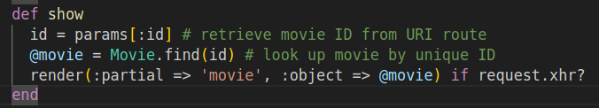
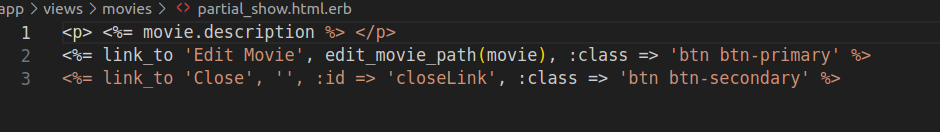
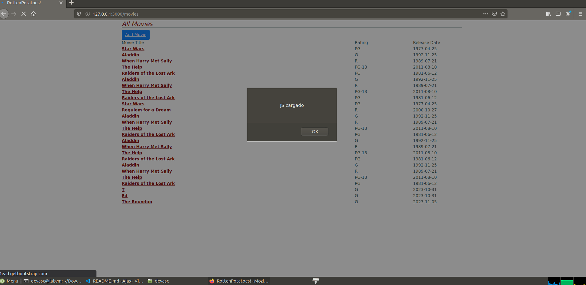
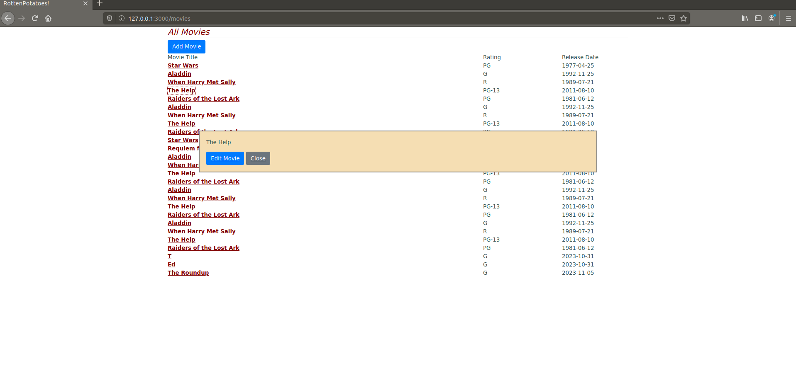

# Parte 1
En el metodo show del controlador debemos especificarle que si es una peticion de tipo xhr entonces nos renderize solo una parte de la pagina.  
  
Ademas en un archivo .erb escribimos lo que debe renderizarse de forma parcial.
  
¿Cómo sabe la acción de controlador si show fue llamada desde código JavaScript o mediante una petición HTTP normal iniciada por el usuario?  
Por lo general en las cabeceras una solicitud web, encontramos informacion sobre el tipo de solicitud que se hizo.

# Parte 2
Creamos un archivo app/javascript/show_movie.js donde pondremos el siguiente codigo
```js
//= require jquery
//= require rails-ujs

var MoviePopup = {
    setup: function() {
      // add hidden 'div' to end of page to display popup:
      let popupDiv = $('<div id="movieInfo"></div>');
      popupDiv.hide().appendTo($('body'));
      $(document).on('click', '#movies a', MoviePopup.getMovieInfo);
    }
    ,getMovieInfo: function() {
      $.ajax({type: 'GET',
              url: $(this).attr('href'),
              timeout: 5000,
              success: MoviePopup.showMovieInfo,
              error: function(xhrObj, textStatus, exception) { alert('Error!'); }
              // 'success' and 'error' functions will be passed 3 args
             });
      return(false);
    }
    ,showMovieInfo: function(data, requestStatus, xhrObject) {
      // center a floater 1/2 as wide and 1/4 as tall as screen
      let oneFourth = Math.ceil($(window).width() / 4);
      $('#movieInfo').
        css({'left': oneFourth,  'width': 2*oneFourth, 'top': 250}).
        html(data).
        show();
      // make the Close link in the hidden element work
      $('#closeLink').click(MoviePopup.hideMovieInfo);
      return(false);  // prevent default link action
    }
    ,hideMovieInfo: function() {
      $('#movieInfo').hide();
      return(false);
    }
  };
  alert("JS cargado")
  $(MoviePopup.setup);
```
MoviePopup.setup:
Esta función se encarga de configurar la ventana emergente.
Crea un `<div>` oculto (popupDiv) al final de la página para mostrar la información de la película.
Agrega un evento 'click' a los enlaces dentro del elemento con el id 'movies' que llama a la función MoviePopup.getMovieInfo.  

MoviePopup.getMovieInfo:
Esta función es llamada cuando se hace clic en un enlace dentro del elemento con el id 'movies'.
Realiza una solicitud AJAX ($.ajax) usando el enlace (href) del elemento clicado.
Espera la respuesta y si tiene éxito, llama a MoviePopup.showMovieInfo para mostrar la información de la película en la ventana emergente.  

MoviePopup.showMovieInfo:
Esta función muestra la información de la película en la ventana emergente.
Calcula la posición y el tamaño de la ventana emergente basándose en el tamaño de la pantalla.
Establece el contenido HTML del div #movieInfo con los datos recibidos y lo muestra.
Agrega un evento 'click' al elemento con el id 'closeLink' para cerrar la ventana emergente.  

MoviePopup.hideMovieInfo:
Esta función oculta la ventana emergente cuando se hace clic en el enlace de cierre ('#closeLink').  

Le agregamos el alert("JS cargado") para verificar que el archivo es cargado correctamente, editamos el metodo show de movies_controller.rb para que nos muestre el parcial_show render(:partial => 'movies/partial_show', :object => @movie) if request.xhr?, y a su vez arreglamos algunos errores del _partial_show.html.erb
```html 
<p> <%= @movie.title %> </p>
<%= link_to 'Edit Movie', edit_movie_path(@movie), :class => 'btn btn-primary' %>
<%= link_to 'Close', '', :id => 'closeLink', :class => 'btn btn-secondary' %>
 ```
* Ademas recalcar que se debe editar el Gemfile para agregar 'jquery-rails'
* Tambien recalcar que para cargar el JS en el index editamos el archivo index.html.erb y le agregamos la linea `<%= javascript_include_tag 'show_movie' %>`
* El codigo CSS tambien se agrego al archivo application.css
Ahora al cargar la pagina vemos que el archivo JS se carga correctamente
  
Y al presionar la pelicula nos aparece la vista parcial de show.
  


# Parte 3
En jQuery podemos usar algo similar, pero que tambien funcionara para bindear eventos a elementos que aun no existe, esto lo logramos haciendo uso de la delegacion de eventos
```js
$(document).on('click', '.myClass', function() {
  // codigo
});
```
Con esto, en lugar de establecer una funcion para el evento de click a los elementos de clase myClass existentes, ahora la funcion se va a establecer para todos los elementos myClass existentes y que se crearan en el documento.