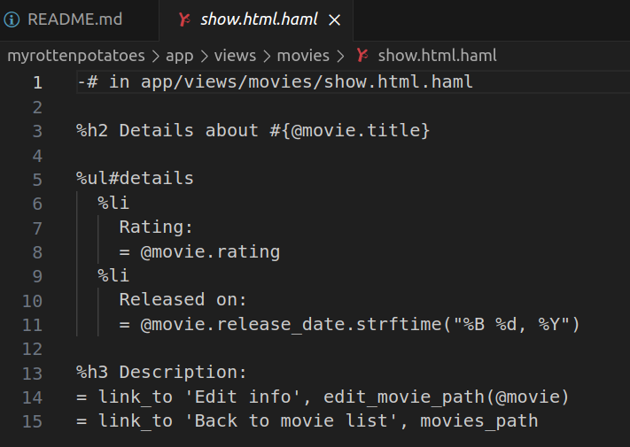

- Muestra la descripción detallada de un objeto en una vista. Por ejemplo, pruebA a insertar `= debug(@movie)` o `= @movie.inspect` en cualquier vista (donde el signo `=` le dice a Haml que ejecute el código e inserta el resultado en la vista).  
Mostramos la vista de show

- Detien la ejecución dentro de un método de un controlador lanzando una excepción cuyo mensaje sea una representación del valor que quieres inspeccionar, por ejemplo, `raise params.inspect`  
Ahora crearemos una excepción usando raise y mostrando el valor de params.inspect

Vemos que nos muestra una excepción.

- Para ver el valor detallado de la hash `params` dentro del método de un controlador. Rails desplegará el mensaje de la excepción como la página web resultante de la petición.
Vemos que la página que nos sirve Rails es la exepción encontrada

- Usa `logger.debug( mensaje)` para imprimir el mensaje al fichero de logging. `logger` está disponible en los modelos y en los controladores y puede registrar mensajes con distintos niveles de importancia. Compara `config/environments/production.rb` con `development.rb` para ver cómo difieren los niveles logs por defecto entre los entornos de producción y desarrollo.
Ahora manejaremos la excepción y cada que que ocurra agregaremos el mensaje al fichero de logging

Vemos que la excepción se maneja, además de ahora mostrarnos correctamente la página de show

Ahora en el archivo de logging, vemos que se agregó la exepción que acabamos de tener

El entorno de desarollo usa el nivel :debug del logger, ya que se necesita ver la mayor información posible de los eventos y errores, por el contrario el entorno de producción usa el nivel :info para solo mostrar logs informativos y superiores.