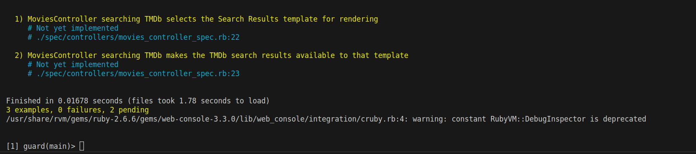

# Parte 1

## Item 1
## Item 2
Si tenemos una instancia de User que no tiene un nombre de usuario, al llamar a @user.valid? nos dará false, ya que al usar :presence => true le estamos diciendo que ese campo es necesario para que el objeto User sea válido.

De la misma forma, al usar @user.save este dará error ya que al usar .save de forma implícita tambien se está llamando a valid? para verificar que sea un objeto válido, así que @user.save nos devolverá false.
En el código para implementar username.format usaremos una expresión regular que nos permite saber si el nombre comienza con una letra y tiene como máximo 10 caracteres, ademas de agregar el error al trace de errores del objeto @user.

Crearemos una nueva aplicación de Rails para probar el código de User, tambien crearemos una modelo de este.


Ahora usamos la consola interactiva de Rails para probarlo, como vemos al usar .valid? y .save lo que nos devuelve es false ya que el atributo username no cuenta con un valor.


Ahora si le damos un valor al atributo username vemos que pasa la validacion y devuelve true, a su vez si el username empieza con un numero, vuelve a fallar la validacion y vemos el log que generó


## Item 3
## Item 4
En el item 4, nos da un formulario y nos pide llenar la función callback que se ejecuta al mandar el usuario, esta función callback deberia ubicarse en el $(document).ready() para que cargue una vez el documento esté listo, a su vez al hacer click en submit le decimos que obtenga el valor de la etiqueta con clase user y la etiqueta con clase pass, así comparamos estos valores con otros ya preestablecidos y mostramos un alert si son o no correctos.

En este caso los valores dados son incorrectos

Y en este caso son correctos.

## Item 5
La metaprogramación basada en eval es un tanto riesgosa ya que nos permite ejecutar cualquier tipo de código Ruby pasado como una cadena de texto, así que deberúamos utilizar la metaprogramación basada en eval en lugar de la metaprogramación basada en bloques que es más segura solo si es necesario como para casos en los que queramos probar algun tipo de codigo en una aplicacion mientras esta esté ejecutándose.

# Parte 2

## Paso 1
Primero configuramos el proyecto haciendo bundle install y generando los archivos de RSpec y Guard, además de correr el servidor para comprobar que todo esté bien.


Ahora creamos el metodo search_tmdb en el movies_controller, además tambien lo agregamos al archivo routes.rb ```get '/search_tmdb', to: 'movies#search_tmdb'```, además al formulario la agregamos la ruta a la que llamaremos, así como el método y un id propio ```form_tag(search_tmdb_path, method: :get, id: "tmdb_form")```, se usa una solicitud get ya que queremos obtener información.
Ahora vemos el resultado


Ahora agregaremos dos botones, uno para volver a inicio, y otro para llegar al página de search, pondremos el primer botón en la vista search_tmdb.html.erb y es ```<%= link_to 'Back to Home', root_path, class: 'btn btn-warning' %>``` y el botón para ir a buscar será parecido ```<%= link_to 'Go to Seach', '/search_tmdb', class: 'btn btn-warning' %>```

Vemos los resultados, y ambos botones funcionan


Ahora podemos ir y volver de la ruta /search_tmdb  

Empezamos con RSpec y escribimos lo siguiente en el archivo spec/controllers/movies_controllers.rb


Y probamos las 3 formas de ejecución
* Usando bundle exec rspec spec/controllers/movies_controller_spec.rb

* Usando bundle exec rspec 

* Usando bundle exec guard vemos que nos abre una consola interactiva y se ejecutan las pruebas cada vez que un archivo cambia


* Nota : Los errores de MoviesController son porque no se habia importado la librería rails-helper


Ahora ya tenemos RSpec configurado así que ahora programaremos las pruebas.

## Paso 2

Cambiamos la primera prueba por 
```ruby
it 'calls the model method that performs TMDb search' do
  get :search_tmdb, {:search_terms => 'hardware'}
end
```
Ahora vemos que guard lo ejecuta y la prueba pasó, ya que nos dice que hubo 0 fallas y faltan 2 pruebas pendientes.

Esta prueba no da error ya que la ruta existe y podemos ir a search_tmdb

Ahora volvemos a editar la primera prueba para falsear los datos que esperaría de una funcion que se llama para buscar las películas.

```ruby
describe MoviesController do
    describe 'searching TMDb' do
        it 'calls the model method that performs TMDb search' do
            fake_results = [double('movie1'), double('movie2')]
            expect(Movie).to receive(:find_in_tmdb).with('hardware').and_return(fake_results)
            get :search_tmdb, {:search_terms => 'hardware'}
        end               
        it 'selects the Search Results template for rendering'
        it 'makes the TMDb search results available to that template' 
    end
end
```
Además de que agregamos un método de clase a Movie, el cual es 
```ruby
def self.find_in_tmdb(search_terms)
end
```
Y también en la función de search_tmdb en el controlador escribiremos 
```ruby
@movies = Movie.find_in_tmdb(params[:search_terms])
```


Al hacer estos cambios y ejecutar la prueba vemos, que esta primera prueba pasa satisfactoriamente ya que no hay fallas, así que nos faltan otras dos por implementar.


¿Por qué la expectativa receive debe preceder a la acción get en la prueba?
Si configuramos la expectativa después de la acción get, la prueba fallará ya que RSpec no podrá comprobar que se llamó al método que queremos en la expectativa, podemos probar esto de la siguiente manera.


Si ponemos el get antes que la expectativa la prueba fallará de este modo.

# Paso 3
Ahora nos ocuparemos del siguiente caso, usaremos el código 
```ruby
it 'selects the Search Results template for rendering' do
  fake_results = [double('movie1'), double('movie2')]
  allow(Movie).to receive(:find_in_tmdb).and_return(fake_results)
  get :search_tmdb, {:search_terms => 'hardware'}
  expect(response).to render_template('search_tmdb')
end
```
Y vemos que la prueba pasa satisfactoriamente.

Primero la parte del `it 'selects the Search Results template for rendering' do` define una prueba para verificar si el controlador selecciona la platilla correcta.
Luego falseamos resultados usando double() el cual es una función de Rails para crear objetos "falsos", los cuales usamos para las pruebas, en este caso para representar objetos Movie.
En esta expectativa decimos que se llame al metodo find_in_tmdb y este retorne los resultados falsos.
Luego simulamos una solicitud GET.
En esta expectativa verificamos que la respuesta que nos devuelve renderiza la plantilla "search_tmdb"
Como ya vimos, la prueba pasa correctamente, podemos hacer que falle si cambiamos el nombre de la plantilla a alguna que no exista.

En este caso vemos que como la plantilla HOLA_UWU no existe entonces la prueba falla.

Ahora editamos el código para agregar un bloque before el cual será ejecutado antes de cada prueba.

¿De qué tipo de objeto crees que @fake_results es una variable de instancia? 
@fake_results es una variable de instancia del objeto de la prueba el cual es una instancia de una clase de RSpec la cual es ExampleGroup


