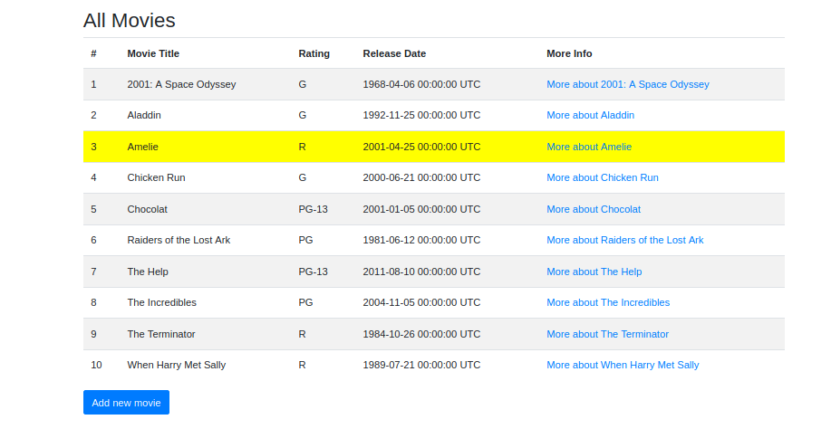

# Pregunta 1
En esta pregunta implementaremos el comando grep en ruby.
Lo que haremos primero será obtener la cadena a buscar y crear las flags que se utilizarán en el comando grep.
```js
const args = process.argv.slice(2);

let arg_n = false;
let arg_l = false;
let arg_i = false;
let arg_v = false;
let arg_x = false;

let cadena = "";
let i = 0;
for (let arg of args) {
  if (arg[0] === "-") {
    break;
  }
  cadena += arg + " ";
  i += 1;
}
cadena = cadena.slice(0, -1);
args.splice(0, i);
```

Ahora obtendremos las flags y los archivos
```js
i = 0;
for (let arg of args) {
  if (arg === "-n") {
    arg_n = true;
  } else if (arg === "-l") {
    arg_l = true;
  } else if (arg === "-i") {
    arg_i = true;
  } else if (arg === "-v") {
    arg_v = true;
  } else if (arg === "-x") {
    arg_x = true;
  } else if (arg[0] === "-") {
    console.log(`grep: -'${arg[1]}' no existe`);
    process.exit();
  } else {
    break;
  }
  i += 1;
}

const files = args.splice(i);
if (!files || files.length === 0) {
  console.log("grep: falta un argumento de fichero");
  process.exit();
}
```

Creamos variables de apoyo y revisamos que los archivos existan
```js
let name_file = false;
if (files.length > 1) {
  name_file = true;
}

const files_l = {};
for (let file of files) {
  if (!fs.existsSync(file)) {
    console.log(`grep: ${file} no es un fichero`);
    process.exit();
  }
```

Iteramos sobre los archivos y leemos cada línea
```js
const actual_file = fs.readFileSync(file, 'utf-8');
  const lines = actual_file.split('\n');
  let number_line = 0;
  
  for (let line of lines) {
    number_line += 1;
```

Ahora verificamos la flag -i si existe entonces convertimos la línea y la cadena a buscar a minúsculas para que no haya problemas con la comparación
```js
if (arg_i) {
      line = line.toLowerCase();
      cadena = cadena.toLowerCase();
    }
```

Ahora la flag -v se usará en las siguiente comparaciones, si la cadena a buscar no se encuentra en la línea entonces se imprime la línea

Para la flag -l almacena los nombres de los archivos en los que la línea existe y se imprime el nombre del archivo
```js
if (arg_l && arg_v) {
      if (!line.match(new RegExp(cadena))) {
        files_l[file] = true;
      }
      continue;
    } else if (arg_l && !arg_v) {
      if (line.match(new RegExp(cadena))) {
        files_l[file] = true;
      }
      continue;
    }
```

Para el flag -x se compara toda la línea con la cadena a buscar, si son iguales entonces se imprime la línea
```js
if (arg_x && !arg_v) {
      if (line === cadena) {
        if (arg_n) {
          if (name_file) {
            console.log(`${file} ${number_line}:${line}`);
          } else {
            console.log(`${number_line}:${line}`);
          }
        } else {
          if (name_file) {
            console.log(`${file}:${line}`);
          } else {
            console.log(line);
          }
        }
      }
      continue;
    } else if (arg_x && arg_v) {
      if (line !== cadena) {
        if (arg_n) {
          if (name_file) {
            console.log(`${file} ${number_line}:${line}`);
          } else {
            console.log(`${number_line}:${line}`);
          }
        } else {
          if (name_file) {
            console.log(`${file}:${line}`);
          } else {
            console.log(line);
          }
        }
      }
      continue;
    }
```

Ahora el argumento -v se usa para imprimir las líneas que no coinciden con la cadena a buscar, en este caso cuando ninguna de las otras flags se cumple
A la vez se usa el argument -n para imprimir el número de línea
```js
if (arg_v) {
      if (!line.match(new RegExp(cadena))) {
        if (arg_n) {
          if (name_file) {
            console.log(`${file} ${number_line}:${line}`);
          } else {
            console.log(`${number_line}:${line}`);
          }
        } else {
          if (name_file) {
            console.log(`${file}:${line}`);
          } else {
            console.log(line);
          }
        }
      }
      continue;
    }
    if (line.match(new RegExp(cadena))) {
      if (arg_n) {
        if (name_file) {
          console.log(`${file} ${number_line}:${line}`);
        } else {
          console.log(`${number_line}:${line}`);
        }
      } else {
        if (name_file) {
          console.log(`${file}:${line}`);
        } else {
          console.log(line);
        }
      }
      continue;
    }
  }
}

if (arg_l) {
  for (let file in files_l) {
    console.log(file);
  }
}
```

# Pregunta 2

```js
class Pokemon {
    constructor(hp, attack, defense) {
      this.hp = hp;
      this.attack = attack;
      this.defense = defense;
      this.movement = "";
      this.level = 1;
      this.type = "";
    }
    fight(){
      if(this.movement == ""){
        throw "No movement selected";
      }
    }
    canFly(){
      if(this.type == ""){
        throw "No type selected";
      }
      if(this.type == "Flying"){
        return true;
      }
      return false;
    }
}

class Charizard extends Pokemon {
  constructor(hp, attack, defense,movement) {
    super(hp, attack, defense);
    this.movement = "Shoot";
    this.type = "Flying";
  }
  fight(){
    if(this.movement == ""){
      throw "No move selected";
    }
    return "Charizard used " + this.movement;
  }
}
let charizard = new Charizard(100, 50, 30);
console.log(charizard.fight());
```

El código define dos clases, `Pokemon` y `Charizard`. `Charizard` es una subclase de `Pokemon` y hereda todas sus propiedades y métodos. `Pokemon` tiene un constructor y dos métodos, `fight` y `canFly`. `Charizard` tiene su propio constructor y sobrescribe el método `fight` de `Pokemon`. Se crea una nueva instancia de `Charizard` y se llama al método `fight`, que registra "Charizard used Shoot".

# Pregunta 3

```ruby
class CurrentDay
    def initialize
        @date = Date.today
        @schedule = MonthlySchedule.new(@date.year, @date.month)
    end
    def work_hours
        @schedule.work_hours_for(@date)
    end
    def workday?
        !@schedule.holidays.include?(@date)
    end
end
```

En el código Ruby dado, el problema de la clase CurrentDay es debido a que al momento de hacer pruebas, el atributo @date depende de un factor externo, en este caso siempre toma el día actual, por eso el método workday no puedo ser testeado correctamente, para tratar de corregir esto podemos sobreescribir el método Date.today con un método personalizado donde le podamos poner la fecha que queramos.

```ruby
before do
    Date.singleton_class.class_eval do
        alias_method :_today, :today
            define_method(:today){Date.new(2020, 12, 16)}
        end
    end
    after do
        Date.singleton_class.class_eval do
        alias_method :today, :_today
        remove_method :_today
    end	
end
```

En JavaScript por otro lado, podemos solucionar esto pasandole al objeto CurrentDay un DateProvider en lugar de simplemente obtener la fecha actual, DateProvider es una clase con la función today, así que para uso en producción podemos usar Date el cual nos devuelve el día actual y para las pruebas podemos usar DateProvider, el cual nos permite establecer un día personalizado.

```js
class CurrentDay {
  constructor(dateProvider, schedule) {
    this.dateProvider = dateProvider;
    this.schedule = schedule;
  }
  
  workday() {
    const today = this.dateProvider.today();
    return !this.schedule.holidays.includes(today);
  }
}
  
// En el código de producción
const currentDay = new CurrentDay(Date, new MonthlySchedule());
  
// En el código de prueba
const dateProvider = { today: () => new Date(2020, 12, 16) };
const testCurrentDay = new CurrentDay(dateProvider, new MonthlySchedule());
```

# Pregunta 4

Para el inciso 'a' nos piden que a cada fila le pongamos su número, esto lo podemos hacer fácilmente modificando el archivo index.html.erb y agregandole una columna de donde pondremos el número de fila, en este caso también crearemos una variable i que será el número de fila mostrado.
```ruby
<table class="table table-striped col-md-12" id="movies">
  <thead>
    <tr>
      <th>#</th>
      <th>Movie Title</th>
      <th>Rating</th>
      <th>Release Date</th>
      <th>More Info</th>
    </tr>
  </thead>
  <tbody>
    <% i = 0%>
    <% @movies.each do |movie| %>
      <tr class="movie-row">
        <td>
          <%= i +=1 %>
        </td>
        <td>
          <%= movie.title %>
        </td>
        <td>
          <%= movie.rating %>
        </td>
        <td>
          <%= movie.release_date %>
        </td>
        <td>
          <%= link_to "More about #{movie.title}", movie_path(movie) %>
        </td>
      </tr>
    <% end %>
  </tbody>
</table>
```

Para el inciso 'b' modificaremos la tabla para establecer la clase "movie-row" en las etiquetas tr `<tr class="movie-row">`, luego en el archivo application.css modificamos la propiedad 'hover' de la clase.
También acotar que se utiliza `!important` para sobreescribir el atributo css de la clase table-striped y el color cambie correctamente.
```css
tr.movie-row:hover{
    background-color: yellow !important;
}
```

En el inciso 'c' y 'd' nos pide modificar el controlador para ordenar las películas por orden del alfabeto, esto lo podemos lograr actualizando usando unas simples líneas, para el caso 'c' haciendo uso de ActiveRecord y el sistema gestor de base de datos podemos usar `@movies = Movie.order(:title)` y para el inciso 'd' usando sort hacemos uso de `@movies = Movie.all.sort_by { |movie| movie.title }`

```ruby
def index
  #@movies = Movie.order(:title)
  @movies = Movie.all.sort_by { |movie| movie.title }
end
```

Ahora como vemos en la imagen, la tabla tiene un número por cada fila, el fondo de la fila cambia al tener el mouse encima y la lista se muestra de forma alfabética, cabe aclarar que el mouse no se ve sobre la fila debido a la captura de pantalla.



# Pregunta 6

En esta pregunta para el inciso 'a' creamos una función que almecene una contraseña y devuelva un objeto que tiene un método para verificar la contraseña inicial que establecimos para un usuario.
```js
function User(username, password) {
    const _password = password;
    return {
        username: username,
        checkPassword: function(inputPassword) {
            return inputPassword === _password;
        }
    };
}
  
const newUser = User('user', '54321');
  
console.log(newUser.checkPassword('54321'));
console.log(newUser.checkPassword('12345'));
```

En el inciso 'b' podemos hacer uso de la función validate proporcionada por JQuery, en el archivo new.html.erb agregamos el script necesario que va a ejecutarse al momento de hacer un submit al formulario.
```ruby
<h2>Create New Movie</h2>
<script>
$(document).ready(function () {
    $("#form-movie").validate({
        rules: {
            title: {
                required: true,
                minlength: 2,
                maxlength: 50
            }
        },
        messages: {
            title: {
                required: "Please enter a title",
                minlength: "Title must be at least 2 characters long",
                maxlength: "Title must be less than 50 characters long"
            }
        },
        submitHandler: function(form) {
            form.submit();
        }
    });
});
</script>
<%= form_tag movies_path, :class => 'form', :id => 'form-movie' do %>
  <%= label :movie, :title, 'Title', :class => 'col-form-label' %>
  <%= text_field :movie, :title, :class => 'form-control' %>

  <%= label :movie, :rating, 'Rating', :class => 'col-form-label'  %>
  <%= select :movie, :rating, ['G','PG','PG-13','R','NC-17'], {}, {:class => 'form-control col-1'} %>

  <%= label :movie, :release_date, 'Released On', :class => 'col-form-label'  %>
  <%= date_select :movie, :release_date, {}, :class => 'form-control col-2 d-inline' %>
  <br/>
  <input type="submit" name="commit" value="Create Movie" class="btn btn-primary" data-disable-with="Create Movie">
  <%= link_to 'Back to Movies', movies_path, :class => 'btn btn-secondary' %>
<% end %>
```