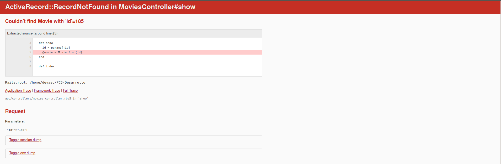
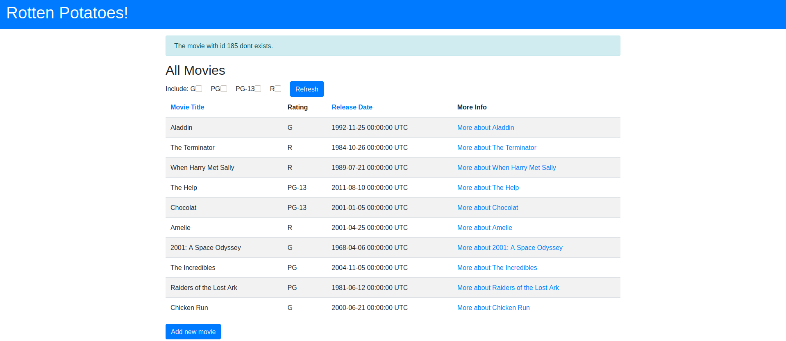
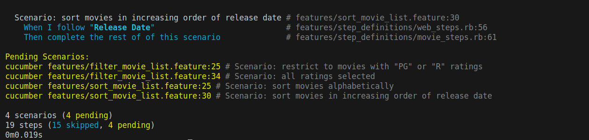
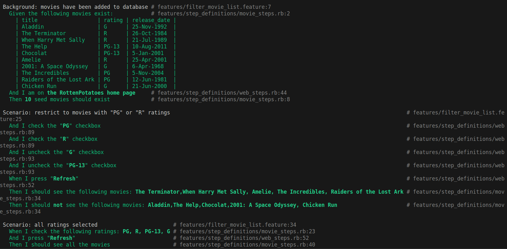
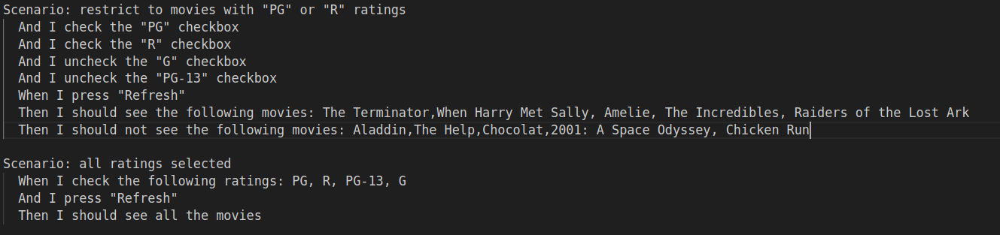
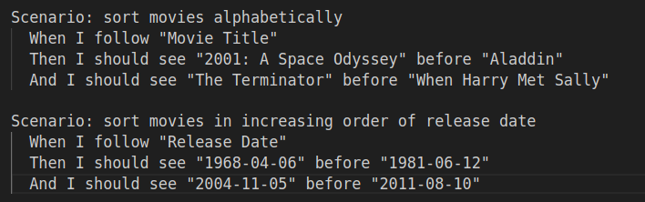
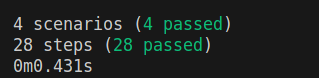

# Pregunta 1
## Item 1
Para esta pregunta usaremos el codigo de la PC3, como vemos al buscar el id de una pelicula que no existe, nos da una pantalla de error


Esto es debido a que como no encuentra el id lanza una excepcion de tipo ActiveRecord::RecordNotFound, asi que haremos uso del begin-rescue para poder manejar la excepcion, agregamos este codigo al metodo show de movie_controller.rb y vemos que pasa
```ruby
begin
    @movie = Movie.find(id)
rescue ActiveRecord::RecordNotFound
    flash[:notice] = "The movie with id #{id} dont exists."
    redirect_to movies_path
end
```

Como vemos ahora al buscar un id que no existe, la aplicacion nos redirige al index y nos muestra un mensaje.

## Item 2
Una de las razones de tener el metodo auth_hash puede ser el de seguir el principio de responsabilidad unica, ademas al tener este método separado, podemos reutilizarlo en otros lugares si es necesario, y escribir pruebas unitarias para asegurarnos que este metodo funcione correctamente.

# Pregunta 2

Como vemos, al hacer el bundle exec cucumber nos muestra que los escenarios aun no han sido probados.


Completamos la pasos en movie_steps.rb
```ruby
Given /the following movies exist/ do |movies_table|
  #Creamos las 10 movies iniciales
  movies_table.hashes.each do |movie|
    Movie.create!(title: movie['title'], rating: movie['rating'], release_date: movie['release_date'])
  end
end
#Comparamos el total de las peliculas con un total ya dado
Then /(.*) seed movies should exist/ do | n_seeds |
  expect(Movie.count).to eq n_seeds.to_i
end
#Esto para comprobar si algo esta antes de otra cosa
Then /I should see "(.*)" before "(.*)"/ do |e1, e2|
  page.body.index(e1).should < page.body.index(e2)
end
    #Creamos las 10 movies inicialeseck, rating_list|
  rating_list.split(',').each do |rating|
    if uncheck
      step %{I uncheck "ratings_#{rating.strip}"}
    else
      step %{I check "ratings_#{rating.strip}"}
    end
  end
end
#Aqui comparamos las peliculas que son o no visibles luego de cambiar los rating
Then /^I should (not )?see the following movies: (.*)$/ do |no, movie_list|
  movie_list.split(',').each do |movie|
    step %{I should #{no}see "#{movie}"}
  end\
end
#Aqui verificamos que vemos todas las peliculas
Then /I should see all the movies/ do
  Movie.all.each do |movie|
    step %{I should see "#{movie.title}"}
  end
end
```

Como vemos ambos escenarios de filter se completan satisfactoriamente.  
Completamos los escenarios de tipo filter con 



Ahora para los escenarios de tipo sort, usamos el I see "Movie A" before "Movie B" para comparar que las peliculas se ordenaron por nombre, y I see "Fecha A" before "Fecha B" para comparar que las peliculas se ordenaron por fecha.



Ahora tenemos todos los test pasados

