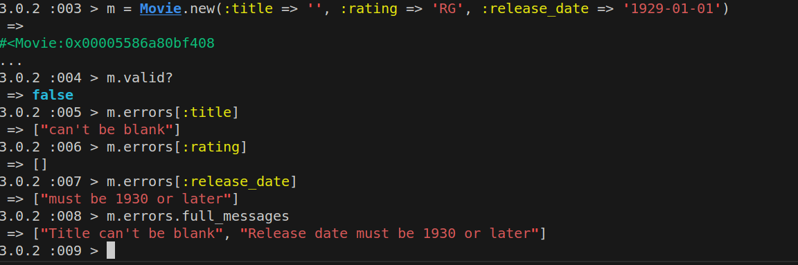
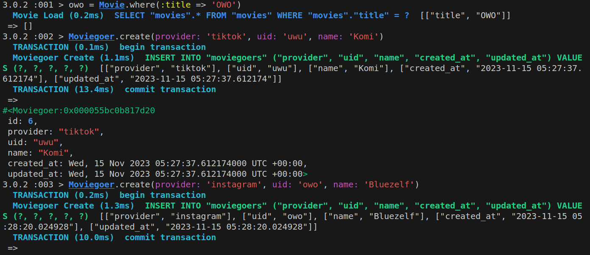
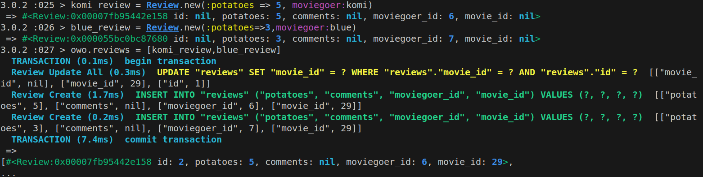
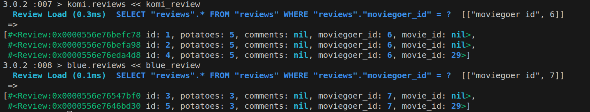
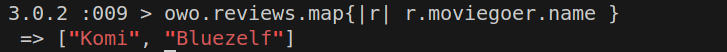

# Actividad 1
Copiamos el codigo que debe ir en movie.rb

```ruby
class Movie < ActiveRecord::Base
    def self.all_ratings ; %w[G PG PG-13 R NC-17] ; end #  shortcut: array of strings
    validates :title, :presence => true
    validates :release_date, :presence => true
    validate :released_1930_or_later # uses custom validator below
    validates :rating, :inclusion => {:in => Movie.all_ratings},
        :unless => :grandfathered?
    def released_1930_or_later
        errors.add(:release_date, 'must be 1930 or later') if
        release_date && release_date < Date.parse('1 Jan 1930')
    end
    @@grandfathered_date = Date.parse('1 Nov 1968')
    def grandfathered?
        release_date && release_date < @@grandfathered_date
    end
end
```
Y probamos en la consola interactiva de Ruby  
  

Para crear la tabla hacemos lo siguiente, usamos el comando rails generate migration CreateMoviegoers, el cual nos creara un archivo de migracion que rellenaremos con el siguiente codigo

```ruby
class CreateMoviegoers < ActiveRecord::Migration[7.0]
  def change
    create_table :moviegoers do |t|
      t.string :name
      t.string :provider
      t.string :uid
      t.timestamps
    end
  end
end
```

Para luego usar rails db:migrate y finalmente tendremos la tabla.

Explicaremos este codigo

```ruby
class MoviesController < ApplicationController
  def new
    @movie = Movie.new
  end 
  def create
    if (@movie = Movie.create(movie_params))
      redirect_to movies_path, :notice => "#{@movie.title} created."
    else
      flash[:alert] = "Movie #{@movie.title} could not be created: " +
        @movie.errors.full_messages.join(",")
      render 'new'
    end
  end
  def edit
    @movie = Movie.find params[:id]
  end
  def update
    @movie = Movie.find params[:id]
    if (@movie.update_attributes(movie_params))
      redirect_to movie_path(@movie), :notice => "#{@movie.title} updated."
    else
      flash[:alert] = "#{@movie.title} could not be updated: " +
        @movie.errors.full_messages.join(",")
      render 'edit'
    end
  end
  def destroy
    @movie = Movie.find(params[:id])
    @movie.destroy
    redirect_to movies_path, :notice => "#{@movie.title} deleted."
  end
  private
  def movie_params
    params.require(:movie)
    params[:movie].permit(:title,:rating,:release_date)
  end
end
```
Este codigo es el controlador de las peliculas, maneja las funciones CRUD para nuestro modelo Movie
* new : Aqui creamos una nueva instancia de la clase Movie,
* create : Con esto manejamos la creacion de una pelicula con los datos mandados desde un formulario, si la creacion es exitosa entonces da un mensaje de exito y redirige a la lista de peliculas, de lo contrario da un mensaje de error y vuelvo al formulario de creacion.
* edit : Aqui editamos la informacion de una pelicula, buscandola a traves de un id.
* update : Este metodo maneja la actualizacion de una pelicula que ya existe, si la actualiza exitosamente entonces redirige a la pagina de informacion de la pelicula, si falla nos redirige a la pagina de edicion.
* destroy : Con esto podemos manejar la destruccion de una pelicula por medio de su id.
* movie_params : Lo usamos para gestionar los parametros que podemos enviar a traves de nuestras peticiones.

# SSO

Copiamos el siguiente codigo en el archivo routes.rb

```ruby
get  'auth/:provider/callback' => 'sessions#create'
get  'auth/failure' => 'sessions#failure'
get  'auth/twitter', :as => 'login'
post 'logout' => 'sessions#destroy'
```

Ahora usamos rails generate controller Sessions para crear un controlador y escribimos el siguiente codigo

```ruby
class SessionsController < ApplicationController
  # login & logout actions should not require user to be logged in
  skip_before_filter :set_current_user  # check you version
  def create
    auth = request.env["omniauth.auth"]
    user =
      Moviegoer.where(provider: auth["provider"], uid: auth["uid"]) ||
      Moviegoer.create_with_omniauth(auth)
    session[:user_id] = user.id
    redirect_to movies_path
  end
  def destroy
    session.delete(:user_id)
    flash[:notice] = 'Logged out successfully.'
    redirect_to movies_path
  end
end
```

# Asociaciones y claves foráneas

```sql
SELECT reviews.*
    FROM movies JOIN reviews ON movies.id=reviews.movie_id
    WHERE movies.id = 41;
```

Esta linea de SQL se utiliza para recuperar información de la base de datos que involucra dos tablas: "movies" y "reviews", junta las tablas cuando el id de la pelicual es igual al id de la review ademas de de dar la condicion que el id de la pelicula debe ser 41.  

Creamos una nueva migracion usando rails generate migration create_reviews y luego rails db:migrate, y en el archivo .rb de la migracion que creamos, copiamos el siguiente codigo

```ruby
class CreateReviews < ActiveRecord::Migration[7.0]
  def change
      create_table 'reviews' do |t|
      t.integer    'potatoes'
      t.text       'comments'
      t.references 'moviegoer'
      t.references 'movie'
      end
  end
end
```
Y en el archivo del modelo review.rb 

```ruby
class Review < ActiveRecord::Base
    belongs_to :movie
    belongs_to :moviegoer
end
```

Ahora copiamos has_many :reviews a las clases Movie y Moviegoer.

Probamos los comandos en la consola interativa de Rails  

Creamos los moviegoers y buscamos la pelicula de muestra.  


Creamos las review y las ponemos en OWO



Ahora guardamos las reviews en la lista de cada moviegoer



Ahora podemos hacer un map para ver los nombres de los moviegoers de cada review



